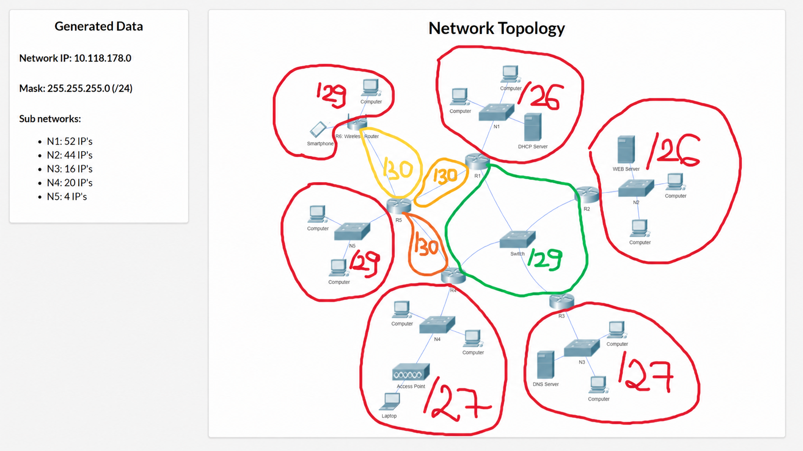

# Computer Networking Final Project

Final project developed using Cisco Packet Tracer.

## Project Overview

The project implements a computer network consisting of five
physical networks interconnected using multiple routers.

The implementation includes:

- VLSM subnetting
- Static IP addressing
- DHCP
- Default gateways
- RIP v2 routing
- DNS
- HTTP/Web Server
- NAT
- Connectivity testing between networks

## Network Topology



## IP Addressing

The initial network assigned to the project is:

`10.118.178.0/24`

The network was divided using VLSM.

| Network | Required Hosts | Subnet | Usable Hosts |
|---|---:|---|---:|
| N1 | 52 | 10.118.178.0/26 | 62 |
| N2 | 44 | 10.118.178.64/26 | 62 |
| N3 | 16 | 10.118.178.128/27 | 30 |
| N4 | 20 | 10.118.178.160/27 | 30 |
| N5 | 4 | 10.118.178.192/29 | 6 |

## Router Connections

The connections between routers use small subnets allocated
from the original `10.118.178.0/24` address space.

Point-to-point connections use `/30` networks where appropriate,
providing two usable addresses per router connection.

## DHCP

DHCP is used to automatically assign IP addresses to clients
in the configured network.

The DHCP configuration includes:

- IP address
- Subnet mask
- Default gateway
- DNS server

## RIP Routing

RIP version 2 is configured between routers.

Example configuration:

```text
Router#
Router#conf t
Enter configuration commands, one per line. End with CNTL/Z.
Router(config)#router rip
Router(config-router)#version 2
Router(config-router)#network VECIN1
Router(config-router)#network VECIN2
Router(config-router)#network VECIN3
Router(config-router)#end
Router#
%SYS-5-CONFIG_I: Configured from console by console
Router#write memory
Building configuration...
[OK]
Router#copy r s
Destination filename [startup-config]?
Building configuration...
[OK]
Router#
```

## DNS

A DNS server is configured to resolve the hostname of the web server.

Example:

```text
www.example.local -> WEB SERVER IP
```

## Web Server

The HTTP server can be accessed from hosts located in the different
physical networks.

Access is tested using:

```text
http://<web-server-name>
```

## NAT

NAT is configured on the appropriate router to allow communication
between the private network and the external network.

The configuration uses:

- ```text
  ip nat inside
  ```
- ```text
  ip nat outside
  ```
- Access control list
- NAT overload
